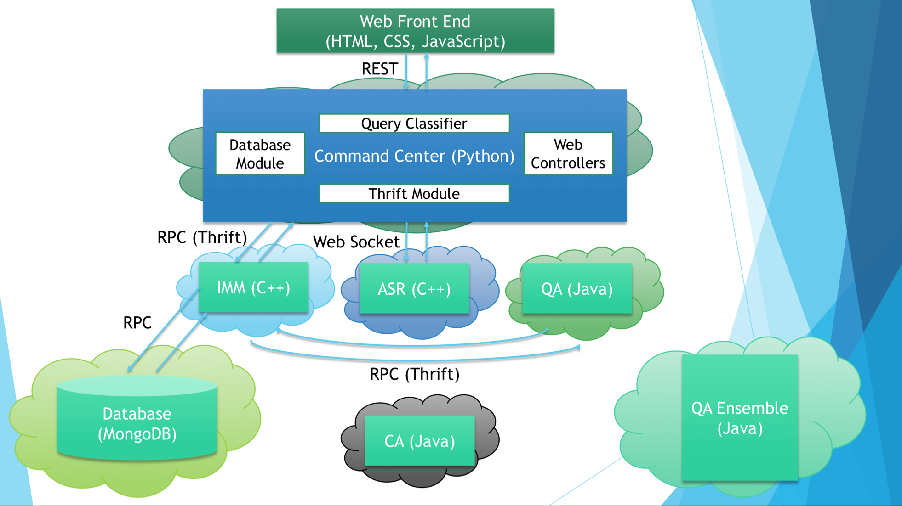

# Lucida

Lucida is a speech and vision based intelligent personal assistant inspired by
[Sirius](http://sirius.clarity-lab.org).
Visit [our website](http://lucida.ai) for tutorial, and
[Lucida-users](http://groups.google.com/forum/#!forum/lucida-users) for help.
The project is released under [BSD
license](LICENSE), except certain submodules contain their own specific
licensing information. We would love to have your help on improving Lucida, and
see [CONTRIBUTING](CONTRIBUTING.md) for more details.

## Overview

- `lucida`: back-end services and command center (CMD). 
  Currently, there are 7 categories of back-end services:
  "ASR" (automatic speech recognition), "IMM" (image matching), "QA" (question answering),
  "CA" (calendar events retrieval), "IMC" (image classification), "FACE" (facial recognition),
  and "DIG" (digit recognition).
  There is another service called "ENSEMBLE" (ensemble-style question answering) which is not part of this repo.
  We will provide instructions on how to set it up soon.

  You can delete or replace these services with your own, or you can simply add a new service.
  For example, if you know some better ASR implementation,
  have an interesting image captioning end-to-end system,
  or have access to a quality machine translation algorithm,
  please read the section "How to Add Your Own Service into Lucida?" below.
  
  The command center determines which services are needed based on the user input,
  sends requests to them, and returns response to the user.
  In the following diagram, the user asks a query that needs the following three services: ASR, IMM, and QA.
  The "cloud" behind each box means the Docker container(s) running on the host machine(s).

  <p align="center">
    
  </p>

- `tools`: dependencies necessary for compiling Lucida.
  Due to the fact that services share some common dependencies,
  all services should be compiled after these dependencies are installed.
  The advantage of a central point of dependencies is that the total size of compiled services is minimized;
  the disadvante is that it makes deleting a service from Lucida non-trivial -- you have to remove its dependencies in `tools`. 

## Lucida Local Development

  If you want to make contributions to Lucida, please build it locally:

- From this directory, type: `make local`. This will run scripts in `tools/` to
  install all the required depedencies. After that, it will compile back-end services
  in `lucida/`.

- Important note for Ubuntu 16.04 users: please read [note #1](tools/README.md).

- If for some reason you need to compile part of it (e.g. one back-end service),
  make sure to set the following environment variable as set in [`Makefile`](Makefile):

  ```
  export LD_LIBRARY_PATH=/usr/local/lib
  ```
  You can add it permanently to your bash profile.

- Start all services:

  ```
  make start_all
  ```

  This will spawn a terminal window (`gnome-terminal`) for each service as well as the command center.
  Once they all start running,
  open your browser and visit `http://localhost:3000/`.
  Check out the [`tutorial`](tutorial.pdf) for usgae and sample questions.
  
  Currently, the command center receives the user input in the form of HTTP requests sent from your browser,
  but in future we can support other forms of input. 

## Lucida Docker Deployment

  If you want to use Lucida as a web application, please deploy using
  [Docker](https://www.docker.com/) and [Kubernetes](http://kubernetes.io/):

- Install Docker: refer to
  [https://docs.docker.com/engine/installation/](https://docs.docker.com/engine/installation/).

- Navigate to [`tools/deploy/`](tools/deploy) and follow the instructions there.

- Once done, check out the [`tutorial`](tutorial.pdf) for usgae and sample questions.

## Design Notes -- How to Add Your Own Service into Lucida?

### Back-end Communication

Thrift is an RPC framework with the advantages of being efficient and language-neutral. 
It was originally developed by Facebook and now developed by both the open-source community (Apache Thrift) and Facebook.
We use both Apache Thrift and Facebook Thrift because Facebook Thrift has a fully asynchronous C++ server but does not support
Java very well. Also, Apache Thrift seems to be more popular.
Therefore, we recommend using Apache Thrift for services written in Python and Java,
and Facebook Thrift for services written in C++.
However, you can choose either one for your own service as long as you follow the steps below.

One disadvantage about Thrift is that the interface has to be pre-defined and implemented by each service. 
If the interface changes, all services have to re-implement the interface. 
We try to avoid changing the interface by careful design, but if you really need to adapt the interface for your need,
feel free to modify, but make sure that all services implement and use the new interface.

### Detailed Instructions

You need to configure the command center (CMD) besides implementing the Thrift interface
in order to add your own service into Lucida. Let's break it down into two steps:

1. Implement the Thrift interface jointly defined in `lucida/lucidaservice.thrift` and `lucida/lucidatypes.thrift`.

  1. [`lucida/lucidaservice.thrift`](lucida/lucidaservice.thrift)

    ```
    include "lucidatypes.thrift"
    service LucidaService {
       void create(1:string LUCID, 2:lucidatypes.QuerySpec spec);
       void learn(1:string LUCID, 2:lucidatypes.QuerySpec knowledge);
       string infer(1:string LUCID, 2:lucidatypes.QuerySpec query);
    }
    ```
    
    The basic funtionalities that your service needs to provide are called `create`, `learn`, and `infer`. 
    They all take in the same type of parameters, a `string` representing the Lucida user ID (`LUCID`),
    and a `QuerySpec` defined in `lucida/lucidatypes.thrift`. 
    The command center invokes these three procedures implemented by your service,
    and services can also invoke these procedures on each other to achieve communication.
    Thus the typical data flow looks like this:
    
    ```Command Center (CMD) -> Your Own Service (YOS)```
    
    But it also can be like this:
    
    ```Command Center (CMD) -> Your Own Service 0 (YOS0) -> Your Own Service 1 (YOS1) -> Your Own Service 2 (YOS2)```
    
    In this scenario, make sure to implement the asynchronous Thrift interface.
    If YOS0 implements the asynchronous Thrift interface,
    it won't block on waiting for the response from YOS1.
    If YOS0 implements the synchronous Thrift interface, it cannot make progress until
    YOS1 returns the response, so the operating system will perform a thread context switch,
    and let the current thread sleep until YOS1 returns. 
    See section 3 of step 1 for implementation details.
    
    `create`: create an intelligent instance based on supplied LUCID.
    It gives services a chance to warm up the pipeline,
    but our current services do not need that. Therefore, the command center does not send `create` request at this point.
    If your service needs to warm up for each user, make sure to modify the command center which is detailed in step 2.
    
    `learn`: tell the intelligent instance to learn new knowledge based on data supplied in the query,
    which usually means the training process.
    Although it has be implemented, you can choose to do nothing in the function body
    if your service cannot learn new knowledge. For example, it may be hard to retrain a DNN model, so the facial recognition
    service simply prints a message when it receives a learn request.
    Otherwise, consider using a database system to store the new knowledge.
    Currently we use MongoDB to store the text and image knowledge.
    You need to tell the command center whether to send a learn request
    to your service or not, which is detailed in step 2.
    
    `infer`: ask the intelligence to infer using the data supplied in the query,
    which usually means the predicting process.
    
    Notice all the three functions take in `QuerySpec` as their second parameters,
    so let's see what `QuerySpec` means for each function.
    
  2.  [`lucida/lucidatypes.thrift`](lucida/lucidatypes.thrift):

    ```
    struct QueryInput {
        1: string type;
        2: list<string> data;
        3: list<string> tags;
    }
    struct QuerySpec {
        1: string name;
        2: list<QueryInput> content;
    }
    ```
    
    A `QuerySpec` has a name, which is `create` for `create`, `knowledge` for `learn`, and `query` for `infer`. 
    A `QuerySpec` also has a list of `QueryInput` called `content`, which is the data payload. 
    A `QueryInput` consists of a `type`, a list of `data`, and a list of `tags`. 
    
    * If the function call is `learn`:
    
    One `QueryInput` is constructed by the command center currently,
    but you should still iterate through all `QueryInput`s in case for change in future.
    For `QueryInput`, `type` can be `text` for plain text, `url` for url address to extract text from, `image` for image,
    or `unlearn` (undo learn) for the reverse process of learn.
    Here is our assumptions: a service can handle either text or image,
    and if it can handle text,
    the types your service should handle are `text`, `url`, and `unlearn`, 
    and if it can handle image,
    the types your service should handle are `image` and `unlearn`.
    See step 2 for details on how to specify the type of knowledge that your service can learn.
    If `type` is `text` or `url`, `data[i]` is the `i`th piece of text or url as new knowledge
    and `tags[i]` is the id of the `i`th piece of text generated by a hash function in the command center;
    if `type` is `image`, `data[i]` is the `i`th image as new knowledge
    (notice that it is the actual string representation of an image and thus can very long),
    and `tags[i]` is the label/name of the `i`th image received from the front end;
    if `type` is `unlearn`, `data` should be ignored by your service (usually a list of an empty string),
    and `tags[i]` is the `i`th id of the text or the image label to delete,
    based on whether the service can handle text or image.
    
    * If the function call is `infer`:
    
    Each `QueryInput` in `content` corresponds to one service (CMD is not considered to be a service)
    in the service graph, a connected directed acyclic graph (DAG) describing all services that are needed for the query.
    Thus, for the following service graph, two `QueryInput`s are present in `content`, each being a node in the graph:
    
    ```Command Center (CMD) -> Your Own Service 0 (YOS0) -> Your Own Service 1 (YOS1)```
    
    For `QueryInput`, `type` can be `text` for plain text, or `image` for image (no `url` for `infer`).
    See step 2 for details on how to specify the type of query that your service can process.
    If `type` is `text`, `data[0]` is the `0`th piece of text;
    if `type` is `image`, `data[0]` is the `0`th image. There is only one string in `data`.
    `tags` have different meanings from `learn` and are of the following format:
    
    ```
    [host, port, <size of the following list>, <list of integers>]
    ```
    
    . `tags` in the `i`th `QueryInput` in `content` describe the location of the `i`th node and its relation to other nodes.
    By location, we mean that the `host:port` specifies the location of the `i`th node.
    By relation to other nodes, we mean that the list of integers specifies the indices of nodes that the `i`th node points to.
    
    Therefore, the above service graph results in a `QuerySpec` that looks like this:
    
    ```
    { name: "query", 
    content: [ 
    { type: "text",
    data: [ "What's the speed of light?" ],
    tags: ["localhost", "8083", "1", "1"] },
    { type: "text",
    data: [ "What's the speed of light?" ],
    tags: ["localhost", "9090", "0"] } ] }
    ```
    
    . We can define arbitrarily complicated service graphs. For example, for the following service graph:
    
    
    
    , the resulting `QuerySpec` may look like this, assuming YOSX is running at 909X:
    
    ```
    { name: "query", 
    content: [
    { type: "image",
    data: [ "1234567...abcdefg" ],
    tags: ["localhost", "9090", "1", 2"] },
    { type: "image",
    data: [ "1234567...abcdefg" ],
    tags: ["localhost", "9091", "2", "2", "3"] },
    { type: "text",
    data: [ "Which person in my family is in this image?" ],
    tags: ["localhost", "9092", "0"] },
    { type: "image",
    data: [ "1234567...abcdefg" ],
    tags: ["localhost", "9093", "0"] } ] }
    ```
    
    . Notice that if the order of `QueryInput` in `content` is rearranged, the resulting `QuerySpec`
    still corresponds to the same graph.
    In fact, there are `2^(N)` valid `QuerySpec`s for a given graph, and you need to define only one of them in
    the configuration file of the command center. Notice that the starting nodes, YOS0 and YOS1, need to be specified separately,
    so that the command center knows where to send the request(s) to. If more than one starting nodes are specified,
    the command center simply concatenates the results returned from all of them.
    See step 2 for more detais on how to specify service graphs and starting nodes.
    
    The command center guarantees to send a valid `QuerySpec`,
    but your service is responsible for parsing the graph, further sending the request(s) to other service(s),
    and returning the response(s) to the service(s) it is pointed to by.
    `tags` simply provide the information of all nodes involved in the service graph.
    That being said, suppose YOS0 deliberately does not send the request to YOS2,
    and YOS2 is written in a way that it cannot return to YOS1 without processing requests from both YOS0 and YOS1.
    Then YOS2 is stalled, which leads to YOS1 waiting for YOS2, and the command center waiting for YOS1.
    Each service is also allowed to ignore or modify the graph if that is necessary, but that should be done with caution.
    
    Although the service graph can be very complicated, it is usually very simple. At least for the current services,
    the most complicated graph looks like this:
    
    ```Command Center (CMD) -> IMM -> QA```
    
    . Thus, some services can ignore the `tags` given the fact that they know they are always the only node in the graph.

  3. Here are the code examples that you can use for your own service:

    If it is written in C++, refer to the code in [`lucida/imagematching/opencv_imm/server/`]
    (lucida/imagematching/opencv_imm/server/).
    Look at `Makefile` for how to generate Thrift stubs which are the abstract base classes your handlers need to inherit.
    Notice that the interface is implemented in `IMMHandler.h` and `IMMHandler.cpp`,
    and the entry point (which uses a multi-threaded server provided by Thrift) is in `IMMServer.cpp`.
    
    If it is written in Java, refer to the code in [`lucida/calendar/src/main/java/calendar/`]
    (lucida/calendar/src/main/java/calendar/) and [`lucida/calendar/`](lucida/calendar/).
    Look at `Makefile` for how to generate Thrift stubs which are the interfaces your handlers need to implement.
    Notice that the interface is implemented in `CAServiceHandler.java`,
    and the entry point (which uses a multi-threaded server provided by Thrift) is in `CalendarDaemon.java`.
    
    If it is written in other programming languages, please refer to [the official tutorial](https://thrift.apache.org/tutorial/).
    
  4. Here is a list of what you need to do for step 1: 
    
    * Add a thrift wrapper which typically consists of a Thrift handler implementing the Thrift interfaces,
      and a daemon program which is the entry point of your service.
      Refer to the code examples mentioned above.
    
    * Modify your `Makefile` so that it uses the Thrift compiler to generate Thrift stubs code.
      Following the style of the existing `Makefile`s is recommended.

    * Test your service.
    
    * (optional) Modify `tools` if you choose to put the dependencies of your service in this central point.
    
    * (Local development) Modify the top-level [`Makefile`](Makefile) and [`lucida/Makefile`](lucida/Makefile)
      so that `make local` and `make start_all` include your service.
    
    * (Docker deployment) Create a Dockerfile image for your service, or merge it into the top-level [`Dockerfile`](Dockerfile)
     and add Kubernetes `yaml` scripts for your service into [`tools/deploy/`](tools/deploy/).

2. Configure the command center. 

  [`lucida/commandcenter/controllers/Config.py`](lucida/commandcenter/controllers/Config.py)
  is the only file you must modify,
  but you may also need to add sample queries to [`lucida/commandcenter/data/`](lucida/commandcenter/data/)
  as training data for the query classifier.
  
  1. Modify the configuration file [`lucida/commandcenter/controllers/Config.py`](lucida/commandcenter/controllers/Config.py).
    
    ```
    SERVICES = { 
    	'IMM' : Service('IMM', 8082, 'image', 'image'),  # image matching
    	'QA' : Service('QA', 8083, 'text', 'text'), # question answering
    	'CA' : Service('CA', 8084, 'text', None), # calendar
    	}
    
    CLASSIFIER_DESCRIPTIONS = { 
    	'text' : { 'class_QA' :  Graph([Node('QA')]),
    	           'class_CA' : Graph([Node('CA')]) },
    	'image' : { 'class_IMM' : Graph([Node('IMM')]) },
    	'text_image' : { 'class_QA': Graph([Node('QA')]),
    	                 'class_IMM' : Graph([Node('IMM')]), 
    	                 'class_IMM_QA' : Graph([Node('IMM', [1]), Node('QA')]) } 
    	}
    ```
    
    * `SERVICES`
    
    `SERVICES` is a dictionary from service name to service object.
    A service object is constructed this way:
    
    ```Service(name, port, input_type, learn_type)```
    
    , where `name` is the name of the service, `port` is the port number,
    `input_type` is the type of query that the service can handle which is either `text` or `image`,
    and `learn_type` is the type of knowledge that the service can learn which is either`text`, `image`, or `None`.
    Recall from step 1 that if `learn_type` is specified as `text`, your service will receive `type` of `text`, `url`, and `unlearn`,
    and if `learn_type` is specified as `image`, your service will receive `type` of `image` and `unlearn`.
    
    Notice that you do not need to specify the IP address of your service. By default it is `localhost`,
    but if you use Kubernetes and run each service behind a Kubernetes `Service`,
    Kubernetes dynamically assigns an IP address to the `Service` and sets an environment variable
    `<SERVICE_NAME>_PORT_<PORT>_TCP_ADDR` for each running container in the cluster.
    This implies that the Kubernetes `Service` defined in the `yaml` file
    should have the same name as the service defined in this Python file.
    All of the current Kubernetes scripts in [`tools/deploy/`](tools/deploy/) follow this naming convention.
    
    For example, if you create a Kubernetes `Service` called `imm` and run your `IMM` container behind it,
    the command center in the same cluster has the following environment variable
    
    ```
    IMM_PORT_8082_TCP_ADDR
    ```
    
    set to something like `10.0.0.92`. This IP address will be `tags[0]` in the `QueryInput` as described in step 1.
    
    Notice that `ASR` (automatic speech recognition) is not listed here.
    The reason is that we currently use [kaldi gstremer server] (https://github.com/alumae/kaldi-gstreamer-server)
    which directly receives real-time voice query from the front end through web socket in the Docker mode.
    
    * `CLASSIFIER_DESCRIPTIONS`
  
    `CLASSIFIER_DESCRIPTIONS` is a dictionary from input type to possible prediction results.
    Internally, the command center uses a query classifier that predicts the needed services
    based on both the input type (transcription text, image, or both) and the content of transcription text if present.
    In the above example, if the user only gives voice input without image, the input type is `text`,
    and the prediction result can be either `class_QA` or `class_CA`.
    If the query is classified as `class_QA` which means generic QA style questions whose training data is
    in [`lucida/commandcenter/data/class_QA.txt`](lucida/commandcenter/data/class_QA.txt),
    the services are needed are represented in a `Graph` with one `Node`, i.e. service `QA`.
    If you want to replace the current QA implementation with your own,
    you can still use the training data, and only modify the service graph to be:
    
    ```
    'text_image' : { 'class_QA': Graph([Node('NAME_OF_MY_OWN_QA_SERVICE')]), ...
    ```
    
    However, if you need to define another set of questions that a user can ask, e.g. questions about image captioning,
    refer to the next section on how to add training data.
    
    Notice that a service `Graph` object is constructed with a list of `Node`
    Each `Node` is constructed with the servide name and an optional list of node indices in the list
    that the current node points to. By default, it is an empty list.
    For example, `'class_IMM_QA' : Graph([Node('IMM', [1]), Node('QA')])` means that the prediction result `class_IMM_QA`
    needs the following services:
    
    ```
    IMM -> QA
    ```
    
    Notice that we do not define which nodes the current node is pointed to by, so we do not know which node is pointed to
    by the command center. Thus, we need to specify the starting nodes separately.
    This is done by an optional second paramater in the constructor of `Graph`:
    
    ```
    def __init__(self, node_list, starting_indices=[0]):
    ```
    
    As you see, by default, the command center assumes the 0th node in the node list is the starting node.
    Thus, a `QuerySpec` like the following will be sent to the `IMM` service:
    
    ```
    { name: "query", 
    content: [
    { type: "image",
    data: [ "1234567...abcdefg" ],
    tags: ["localhost", "8082", "1", 1"] },
    { type: "text",
    data: [ "How old is this person?" ],
    tags: ["localhost", "8083", "0"] } ] }
    ```
    
    The `IMM` service receives this `QuerySpec` along with `LUCID`, and is responsible for further sending
    the request to the `QA` service. The `IMM` service is allowed to modify the `QuerySpec` and
    send a reconstructed `QuerySpec` to `QA`, but as long as `IMM` finally returns a `string` to the
    command center, it is fine. This degree of flexibility opens up opportunities for complicated communication
    between your services. Usually, a graph with one node suffices, because that one node may be an entry point
    to a cluster of your services, which may have complicated feedback loops and use a different communication mechanism.
    
    Notice that there is only one possible prediction result if the user only gives image input: `class_IMM`,
    because the query classifier only works on text input.
    However, you can still send the image to multiple services like this:
    
    ```
    ''image' : { 'class_IMM' : Graph([Node('IMM'), Node('IMC'), Node('IMAGE_CAPTIONING')], [0, 1, 2]) }, ...
    ```
    
    Be aware that there are other parameters that you can change in this configuration file,
    which are pretty self-explanatory in their names and comments.
    
  2. Add training data for your own query class.
  
    We already prepare some sample training data in [`lucida/commandcenter/data/`](lucida/commandcenter/data/),
    but if you need to define a custom type of query that your service can handle,
    you should create the following file in the above directory:
  
    ```
    class_<NAME_OF_YOUR_QUERY_CLASS>.txt
    ```
    
    , and have at least 40 pieces of text in it, each being one way to ask about the same question.
    
