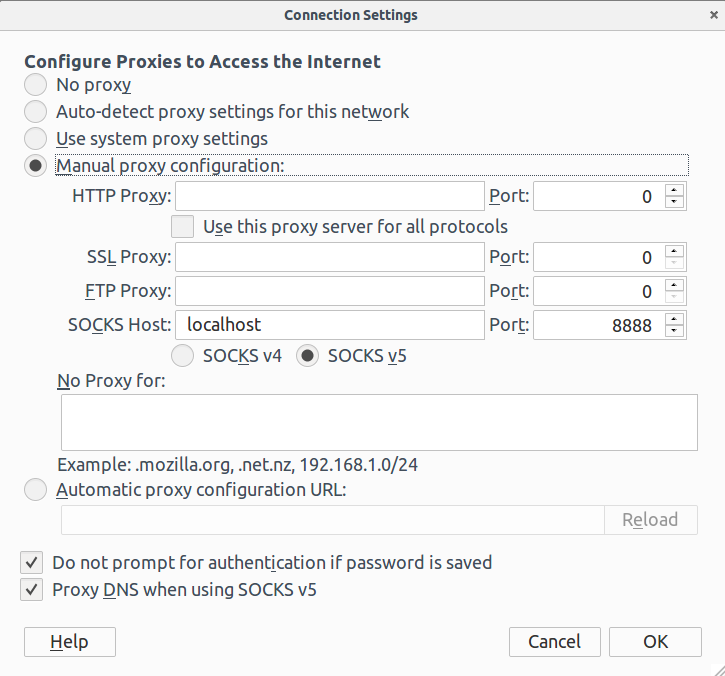

Microsoft BotFramework interface to Lucida
==========================================

This interaface allows accessing Lucida services from BotFramework supported channels like Facebook, Skype, messaging etc. Currently only text infer queries are supported.

## Installation
* Change directory to $LUCIDAROOT/botframework-interface and run `make all`
* Create a new bot at https://dev.botframework.com/bots/new
    - Fill in the name, bot handle and description for your bot.
    - Click on 'Create Microsoft App ID and password. Then click on generate password. Copy your App ID and password and keep them in a safe place.
    - Leave all other fields blank unless you know what you are doing.
    - Agree to the terms and click on 'Register' to finish registering your bot.
* You may want to add channels on the bot page. Follow the instructions on https://dev.botframework.com/bots.

## Start Interface
* Change directory to $LUCIDAROOT/botframework-interface and run `make start_server`
* First run will ask some questions. These can be modified later by editing 'config.sh'.

## Add User
* Add the bot to your channel. This can be done using 'Add to Skype' button for Skype channel and adding yourself as developer for corresponding Facebook bot for Facebook Messenger channel.
* Connect your Lucida user to channel user
    - Sign in to the web interface of Lucida and click on your username.
    - Copy the verification message (Verify <token>) and send it using the channel you want to verify.

## Setting Message Endpoint Manually
While most users should be able to set endpoint automatically, some may face network problems. Automatic update of endpoint will also break if Microsoft updates its website. For such scenarios you can
set the endpoint manually by logging into https://dev.botframework.com/bots, selecting your bot, going to settings and following one of the following methods.

#### If the BotFramework interface for Lucida is running on a https server
* Type the address of the server followed port on which the interface is running and '/api/messages' ( e.g. `https://example.com:3728/api/message` ) and save the changes.
#### If you don't have a server
* Type `ngrok http 3728` to start ngrok. The port 3728 should be changed if interface is running on a different port.
* You'll see a `https://*.ngrok.io` address when ngrok goes online. Copy this appended with '/api/messages' to Messaging endpoint field and save the changes.
* The endpoint will change everytime you restart ngrok. You'll need to change endpoint on https://dev.botframework.com/bots every time you restart ngrok.

## Troubleshooting
#### First one or two messages not being received by command center
This is more of a bug. This happens because the change in endpoint doesn't propagate as it should. I have mailed Microsoft team about this and am waiting for their reply. Don't expect this to be fixed soon as Microsoft doesn't encourage changing endpoint frequently.
#### Microsoft needs additional information to sign you in
This error usually occurs when you run interface on a remote server. Microsoft detects that you are signing in from a different region/PC and asks the interface questions that it cannot currently answer. To fix the error:
* SSH into your remote server with `-D 8888` option passed to openssh (e.g. `ssh -D 8888 user@remote_host` ).
* Open Firefox (not a private window) on your local machine and go to Edit->Preferences->Advanced->Network->Connection->Settings.
* Fill the details as shown below

* Old versions of Firefox do not have an option to 'Proxy DNS when using SOCKS v5'. If you are using one of those versions
  - Navigate to 'about:config'
  - Click on 'I accept the risk!'
  - Type 'socks' in the search box
  - Double click 'network.proxy.socks_remote_dns' to toggle it to true.
* Navigate to 'https://dev.botframework.com/bots/' and sign in
* Run `make start_server` in botframework directory of your remote host
* If everything works fine undo the changes you made to your Firefox. Otherwise create an issue on the git repository.

NOTE: The bot won't be available in bot directory unless you publish it. Till then only the people with 'Add to Skype' link (in case of Skype) and ones listed as developers/testers (in case of Facebook)
will be able to send messages to the bot.
